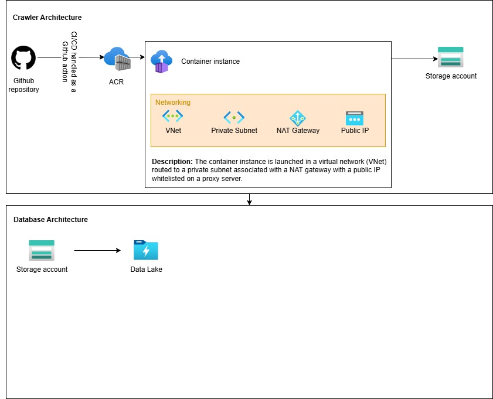

### Inter-detector backend

"Inter-detector" is a project that involves using publically available data to build a machine learning model which predicts how a player in a game called League of Legends performed in their last game. The intended result is a SHAP explainer of a logistic regression model that will tell a user what features most impacted the outcome of their last game; for instance, the amount of kills, deaths, assists, or time-based features, like CS difference at 10 minutes. The project has 4 teams: data crawling, data processing, data science (the ML model), then a front-end application. This repository includes the Terraform infrastructure in Azure for everything.

Explained in detail:
1. Data crawling: a serverless architecture to run a Docker container which gathers publically available data. The script to gather data is in a separate repository. This is an Azure container instance which pushes data to Azure storage.
2. Data processing: a database built on top of hierarchical file structure located in Azure. This will likely be an Azure data lake.
3. Data science: a logistic regression model trained on match data, visualized with SHAP plots.
4. Front-end application: still in progress, not sure what this will look like.

Currently, the project is still at stage one 😪



### Installation Steps

1. [Install terraform](https://developer.hashicorp.com/terraform/tutorials/aws-get-started/install-cli)
2. [Install Azure CLI](https://learn.microsoft.com/en-us/cli/azure/install-azure-cli)
3. Create a subscription in Azure

### Create

#### One-Time Setup

```sh
# Login to Azure
az login --scope https://graph.microsoft.com//.default
# Or, if you don't want to open browser:
az login --use-device-code

# This adds an Azure storage account for Terraform remote state
cd ~/bootstrap
terraform init
terraform apply
```

#### Data Crawling

TO-DO: Further split this into ACR, etc. and then ACS.

```sh
# This adds a serverless architecture for running data crawling
cd ~/data-crawling
# Optional, choose workspace
terraform workspace new dev
# Or, if the workspace exists
terraform workspace dev
terraform plan
terraform apply
# The task will fail to get created, since there's no image in ACR
# Push image to ACR, e.g. through below CI/CD integration
terraform apply
```

_CI/CD Integration_

The CI/CD pipeline is handled as a Github action in the data crawling repository. Include these values as repository secrets!

```sh
# For CI/CD
# Use this as AZURE_CLIENT_ID
terraform output app_client_id
# Use this as AZURE_CLIENT_SECRET
terraform output app_password
# Use this as AZURE_REGISTRY
# azurerm_container_registry.acr.name
```

#### Data Processing

```sh
terraform workspace dev
```

### Destroy

```sh
cd ~/bootstrap
terraform destroy

cd ~/data-crawling
terraform destroy
```